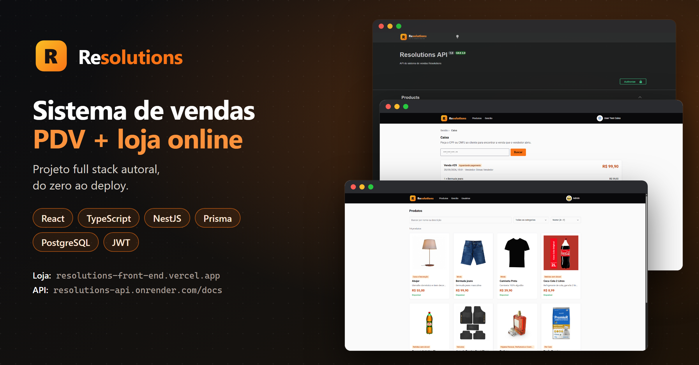
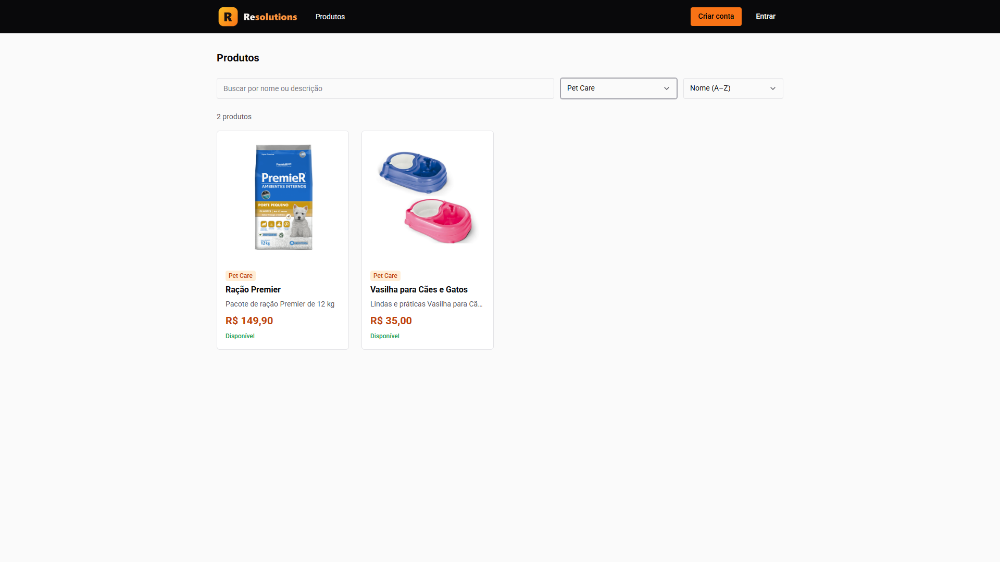
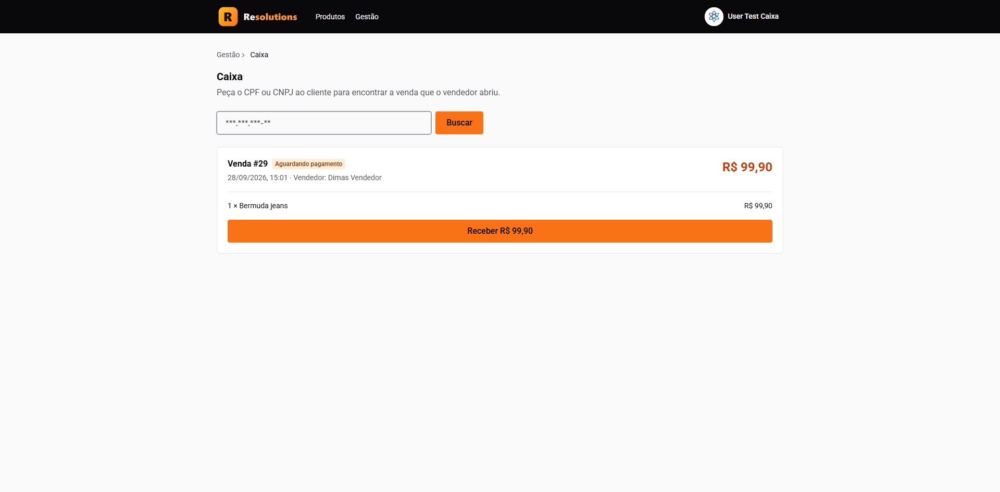
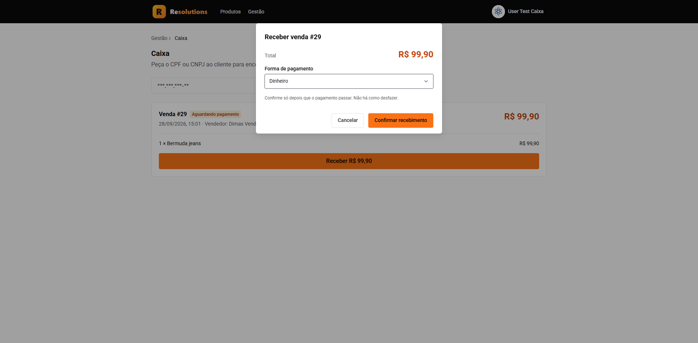
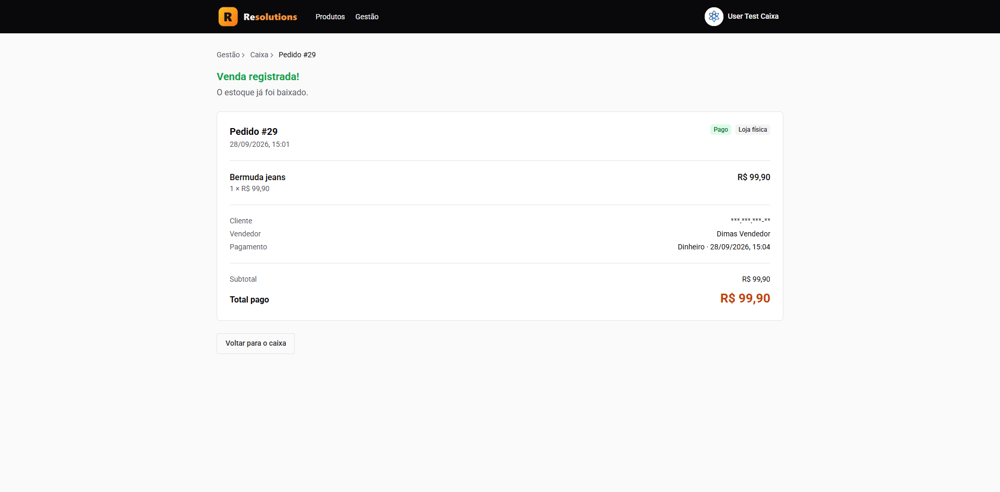
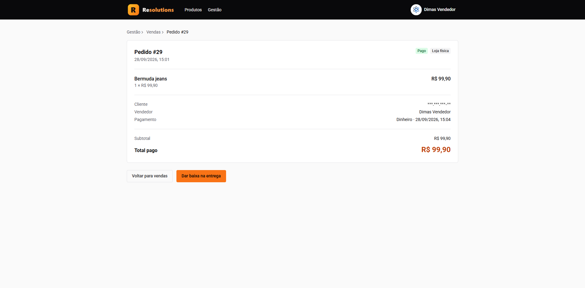
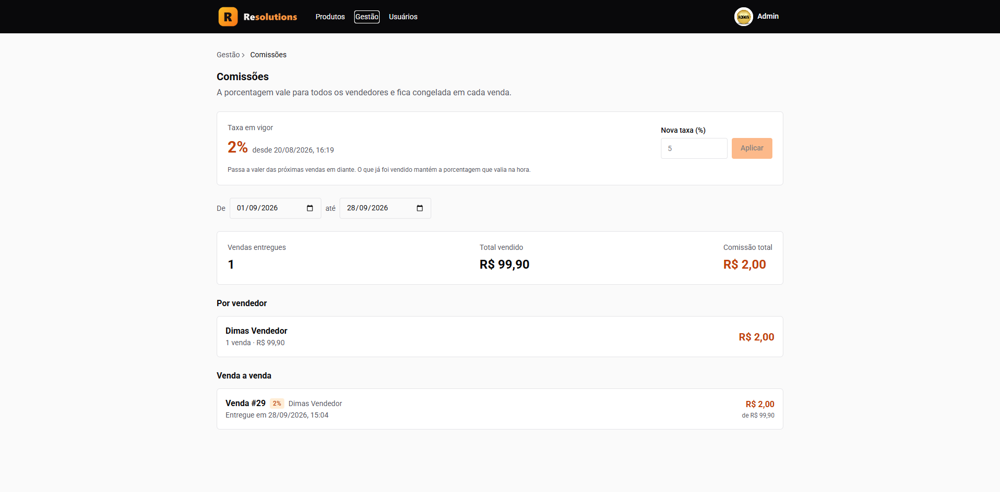
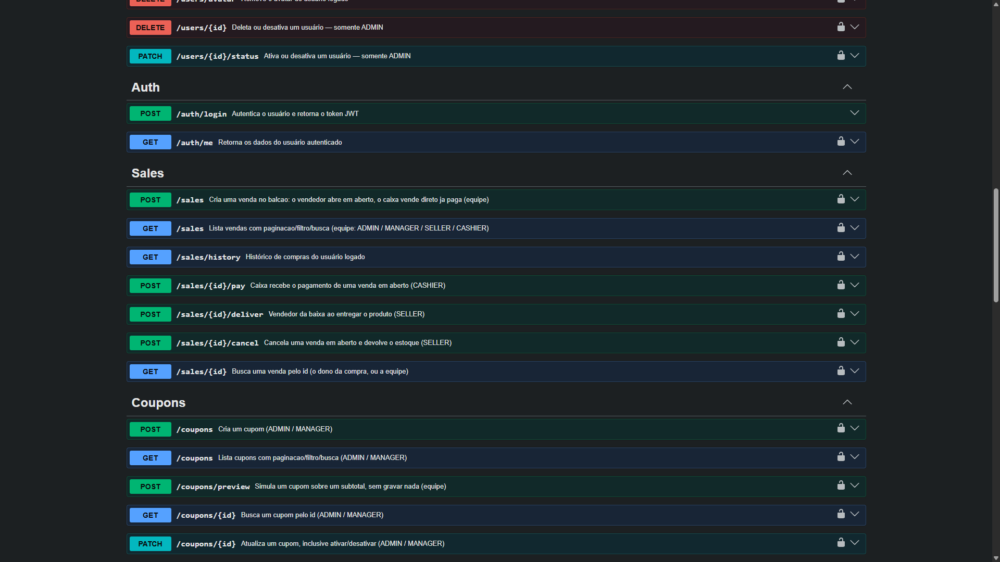

<p align="center">
  
</p>

<h1 align="center">Resolutions</h1>

<p align="center">
  <b>Sistema de vendas completo: PDV para loja física + loja online.</b><br>
  Projeto full stack autoral, do banco de dados ao deploy.
</p>

<p align="center">
  <a href="https://resolutions-front-end.vercel.app"><b>🔗 Acessar a loja</b></a> ·
  <a href="https://resolutions-api.onrender.com/docs"><b>📄 Documentação da API</b></a> ·
  <a href="https://www.linkedin.com/in/dimas-capelari"><b>💼 Falar comigo</b></a>
</p>

> ⏳ A API está no plano gratuito do Render: o primeiro acesso pode levar cerca de 50 segundos para "acordar".

---

## ✨ Funcionalidades

### 🛒 Loja online
- Vitrine pública com busca (insensível a acento), filtro por categoria e ordenação
- Página do produto com galeria de imagens
- Carrinho, cupom de desconto e checkout
- Histórico de compras do cliente

### 🧾 PDV — loja física
- **Balcão:** o vendedor abre a venda pelo código de barras ou pelo nome do produto, vinculada ao CPF/CNPJ do cliente
- **Caixa:** encontra a venda pelo CPF/CNPJ e recebe o pagamento
- Estoque baixado na hora do pagamento; se a venda for cancelada, o estoque volta
- Baixa na entrega pelo vendedor

### 📊 Gestão
- Produtos (com até 5 imagens e escolha da capa), categorias e cupons
- Vendas com filtros por canal, status, período e cliente
- **Comissões:** a taxa fica congelada em cada venda; relatório por período e por vendedor
- Usuários e papéis

### 🔐 Segurança
- Autenticação com JWT e senhas com bcrypt
- Controle de acesso por papel: **Admin, Gerente, Vendedor, Caixa e Cliente** — cada um só faz o que pode
- Validação de dados em todas as entradas da API

---

## 🖼️ Telas

### Loja online


### Fluxo da loja física

| 1. Caixa encontra a venda pelo CPF | 2. Confirma o pagamento |
| --- | --- |
|  |  |
| **3. Venda registrada e estoque baixado** | **4. Vendedor dá baixa na entrega** |
|  |  |

### Comissões


### API documentada (Swagger)


---

## 🛠️ Stack

| Camada | Tecnologias |
| --- | --- |
| **Front-end** | React 19 · TypeScript · Vite · Chakra UI · React Hook Form · Zod |
| **Back-end** | NestJS · Prisma · PostgreSQL · JWT · bcrypt · Swagger |
| **Imagens** | Cloudinary |
| **Deploy** | Vercel (front) · Render (API) · Neon (banco de dados) |

```
  Navegador ──► Front-end (Vercel) ──► API NestJS (Render) ──► PostgreSQL (Neon)
                                               │
                                               └──► Cloudinary (imagens)
```

---

## 📦 Sobre o código

O código-fonte deste projeto é **privado**. Este repositório é uma vitrine do sistema.

Tem interesse no Resolutions para o seu negócio, ou quer conversar sobre um projeto sob medida?
**[Me chame no LinkedIn](https://www.linkedin.com/in/dimas-capelari)** 🚀

---

<p align="center">
  Feito por <a href="https://github.com/dimascapelari"><b>Dimas Capelari</b></a> — Desenvolvedor Full Stack | Do Figma ao deploy
</p>
